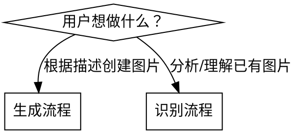

# MiniMax 图片生成与识别技能

两种能力：
- **生成**：`mmx image generate`（model: `image-01`）— 文字→图片
- **识别**：`mmx vision describe`（VLM）— 图片→文字描述/分析

> **默认原则**：先判断用户想「生成」还是「理解」图片，分别进入不同流程。

---

## 工作流选择



---

## 生成流程

### G1. 引导需求

| 问题 | 目的 |
|------|------|
| 想画什么？（主体+场景+风格） | 核心描述 |
| 比例是多少？（16:9 横屏 / 1:1 方形 / 9:16 竖屏） | `--aspect-ratio` |
| 要几张？（想多选一张最好的？） | `--n` |
| 有角色参考图吗？（保持人物一致性） | `--subject-ref` |

### G2. Prompt 构建

**结构**：`[主体] + [动作/状态] + [场景/背景] + [风格/氛围] + [细节修饰]`

| 用户描述 | 专业提示词 |
|----------|-----------|
| 古风仙女 | ethereal celestial maiden in white flowing robes, misty mountains, moonlight, ink wash painting style |
| 产品图 | sleek smartphone on white background, studio lighting, clean minimal, commercial photography |
| 赛博朋克城市 | cyberpunk cityscape at night, neon reflections on wet streets, towering holographic ads, cinematic |
| 可爱卡通风 | cute chibi character, pastel colors, soft shading, white background, digital illustration |
| 写实人像 | photorealistic portrait, soft natural light, shallow depth of field, detailed facial features |

**提升质量的通用词**：
- 细节：`ultra-detailed`, `8K`, `sharp focus`
- 艺术风格：`digital art`, `concept art`, `watercolor`, `oil painting`
- 光线：`golden hour`, `soft studio light`, `dramatic shadows`

### G3. 生成命令

**两种输出方式：**

| 方式 | 命令 | 图片位置 |
|------|------|---------|
| 指定精确路径（推荐） | `--out /path/to/file.jpg` | 直接保存到该路径 |
| 目录 + 自动命名 | `--out-dir ./output/` | `image_001.jpg` 等 |

**`--out` vs `--out-dir` 注意事项：**
- `--out` 在指定精确路径方面可靠，但 `--out-dir` + auto-naming 适合批量生成多张
- `mmx image generate` 的 `--out` 会截断输出（只显示第一个文件名），但文件实际保存正确

**示例：**

```bash
# ✅ 推荐：指定精确输出路径
mmx image generate \
  --prompt "A majestic white wolf in a snowy forest, ethereal, photorealistic" \
  --aspect-ratio 16:9 \
  --out /tmp/wolf.jpg \
  --quiet

# 批量生成（--out-dir + auto-naming）
mmx image generate \
  --prompt "Minimalist logo design, geometric, professional" \
  --n 4 \
  --aspect-ratio 1:1 \
  --out-dir ./logos/ \
  --quiet

# 自定义尺寸（512-2048，8的倍数）
mmx image generate \
  --prompt "Banner background, abstract blue gradient" \
  --width 1920 --height 1080 \
  --out /tmp/banner.png \
  --quiet

# 可复现（seed 相同则结果相同）
mmx image generate \
  --prompt "A castle on a cliff at sunset" \
  --seed 42 \
  --aspect-ratio 16:9 \
  --out /tmp/castle.jpg \
  --quiet

# ⚠️ 角色一致性（character reference）— 格式必须是 type=character,image=<路径>
# ❌ 错误：--ref-image、--input-image（这些是 generate_image.sh 脚本的参数，不是 mmx CLI 的）
mmx image generate \
  --prompt "The character sits in a cafe, reading a book, warm light" \
  --subject-ref "type=character,image=character.jpg" \
  --aspect-ratio 1:1 \
  --out /tmp/person.jpg \
  --quiet

# Prompt 优化
mmx image generate \
  --prompt "sunset" \
  --prompt-optimizer \
  --aspect-ratio 16:9 \
  --out /tmp/sunset.jpg \
  --quiet
```

---

## 识别流程

### V1. 使用场景

| 任务 | 方法 |
|------|------|
| 图片内容描述 | 默认 prompt（不传） |
| 提取图片中的文字（OCR） | `--prompt "请提取图片中所有文字"` |
| 分析 UI 截图 | `--prompt "描述这个界面的结构和功能"` |
| 识别错误截图 | `--prompt "这个错误信息是什么？怎么解决？"` |
| 分析架构图/流程图 | `--prompt "解释这张图的结构和各组件关系"` |
| 判断图片内容是否符合要求 | `--prompt "这张图是否包含XX？"` |

### V2. 识别命令

```bash
# 描述本地图片
mmx vision describe \
  --image photo.jpg \
  --quiet

# 带问题的图片分析
mmx vision describe \
  --image screenshot.png \
  --prompt "这个界面是做什么的？有什么问题？" \
  --quiet

# 识别网络图片
mmx vision describe \
  --image "https://example.com/image.jpg" \
  --prompt "描述这张图片" \
  --quiet

# OCR 提取文字
mmx vision describe \
  --image document.jpg \
  --prompt "请提取图片中所有文字，保持原有格式" \
  --quiet

# 错误截图分析
mmx vision describe \
  --image error_screenshot.png \
  --prompt "分析这个错误信息，给出解决方案" \
  --output json --quiet
```

---

## 组合模式：生成→分析

```bash
# 生成图片后立即分析
URL=$(mmx image generate \
  --prompt "A futuristic city" \
  --quiet | head -1)

mmx vision describe \
  --image "$URL" \
  --prompt "描述这张图中的建筑风格和色彩" \
  --quiet
```

---

## 注意事项

**生成：**
- 默认模型：`image-01`（备选：`image-01-live`，更适合写实人像）
- `--width/--height` 仅 `image-01` 支持，范围 512-2048，必须是 8 的倍数
- `--subject-ref` 格式：`type=character,image=本地路径或URL`
- 涉及人脸/版权内容可能触发过滤器

**识别：**
- 支持本地文件（自动 base64 编码）和 URL
- `--file-id` 可传预上传的文件 ID（跳过 base64，更快）
- 默认 prompt 为 `"Describe the image."`
- 始终加 `--quiet` 避免进度条干扰
