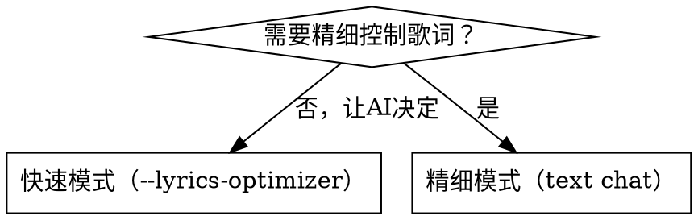

# MiniMax 歌词生成技能

通过两种方式生成歌词：
- **快速模式**：`mmx music generate --lyrics-optimizer`（直接生成可用于音乐的歌词）
- **精细模式**：`mmx text chat`（先用 LLM 精细创作，再格式化为音乐标签）

> **默认原则**：先了解主题和感觉，再生成。歌词生成后必须展示给用户确认再用于音乐合成。

---

## 工作流总览

```
用户描述主题
  ↓
【第一步】引导需求（5个问题）
  ↓
【第二步】选择生成方式
  ↓
【第三步】生成歌词草稿
  ↓
【第四步】添加结构标签（用于音乐生成）
  ↓
【第五步】展示给用户确认
```

---

## 第一步：引导需求

| 问题 | 示例回答 |
|------|---------|
| 这首歌想讲什么故事/传达什么情感？ | "失恋后的释怀" / "对家乡的思念" |
| 风格偏向哪种？（古风/流行/民谣/说唱/R&B…） | "现代流行" |
| 主人公视角？（第一人称自述 / 旁观者叙事） | "我"说 |
| 想要几段？（通常：2主歌+1副歌+1桥段） | "标准结构就好" |
| 有没有特定词汇/意象要包含？ | "想用'月光'和'离别'" |

---

## 第二步：选择生成方式



| 方式 | 适用场景 | 命令 |
|------|---------|------|
| 快速模式 | 风格描述清晰，不需逐字调整 | `mmx music generate --lyrics-optimizer` |
| 精细模式 | 有具体意象要求、故事线、特定词汇 | `mmx text chat` 生成，再手动加标签 |

---

## 第三步A：快速模式（lyrics-optimizer）

`--lyrics-optimizer` 会根据 `--prompt` 自动生成歌词并直接合成音乐（**无法单独获取歌词文本**）。

```bash
# 快速生成带歌词的音乐（歌词由模型自动生成）
mmx music generate \
  --prompt "现代流行，失恋后的释怀，温柔女声，钢琴+弦乐，BPM 80" \
  --lyrics-optimizer \
  --out output.mp3 \
  --quiet
```

> **注意**：`--lyrics-optimizer` 不能与 `--lyrics` 同时使用，无法预览歌词。如需查看歌词，请用精细模式。

---

## 第三步B：精细模式（text chat）

```bash
# 用 LLM 生成歌词
mmx text chat \
  --system "你是一位专业词作人，擅长中文流行歌曲创作。" \
  --message "请为以下主题创作一首歌词：
主题：失恋后的释怀
风格：现代流行
结构：2段主歌 + 1段预副歌 + 2段副歌 + 1段桥段
要求：
- 押韵，每段统一韵脚
- 主歌叙事，副歌情感爆发
- 包含'月光'意象
- 每句 7-8 字
请直接输出歌词，不要解释。" \
  --quiet
```

---

## 第四步：添加结构标签

将生成的歌词按段落添加标签（标签内只能有歌词，不能有描述）：

```
[Intro]     引子（有人声时用）
[Inst]      纯器乐段（无人声，约 20-40 秒）
[Solo]      独奏段（无人声，约 30 秒）
[Verse]     主歌
[Pre Chorus] 预副歌
[Chorus]    副歌
[Bridge]    桥段
[Outro]     结尾
[Build Up]  积累段（高潮前）
[Transition] 过渡段
[Hook]      钩子（反复短句）
```

### 标签示例

```
[Verse]
月光落在空荡的房间
你的气息还留在枕边
那些说好的明天和诺言
不知道飘向了哪一片云彩

[Chorus]
我终于学会了放开手
不再追着你的背影走
眼泪算什么 释怀才自由
谢谢你 给了我成长的理由
```

---

## 第五步：保存并确认

```bash
# 保存歌词到文件
cat > lyrics.txt << 'EOF'
[Verse]
（主歌歌词）

[Pre Chorus]
（预副歌歌词）

[Chorus]
（副歌歌词）

[Bridge]
（桥段歌词）

[Chorus]
（副歌再现）

[Outro]
（结尾歌词）
EOF
```

展示完整歌词给用户审核，确认后可直接传给 mmx-music 技能生成音乐。

---

## 古风歌词创作技巧

参考 mmx-music 技能的「古风歌词创作技巧」章节：
- 四种句式（五字/七字/四字/长短句）
- 镜像结构（尾声重复引子，末句改变）
- 韵脚规律（同段统一押韵，避免重复字）
- 意象选择（月、雪、风、剑、烟等经典意象）

---

## 注意事项

- 歌词最长约 3500 字符（超出会被截断）
- `[Inst]` `[Solo]` 标签内不要写文字，否则会被演唱出来
- 同一标签可重复使用（如两个 `[Chorus]`）
- 生成歌词后始终展示给用户确认再进行音乐合成
